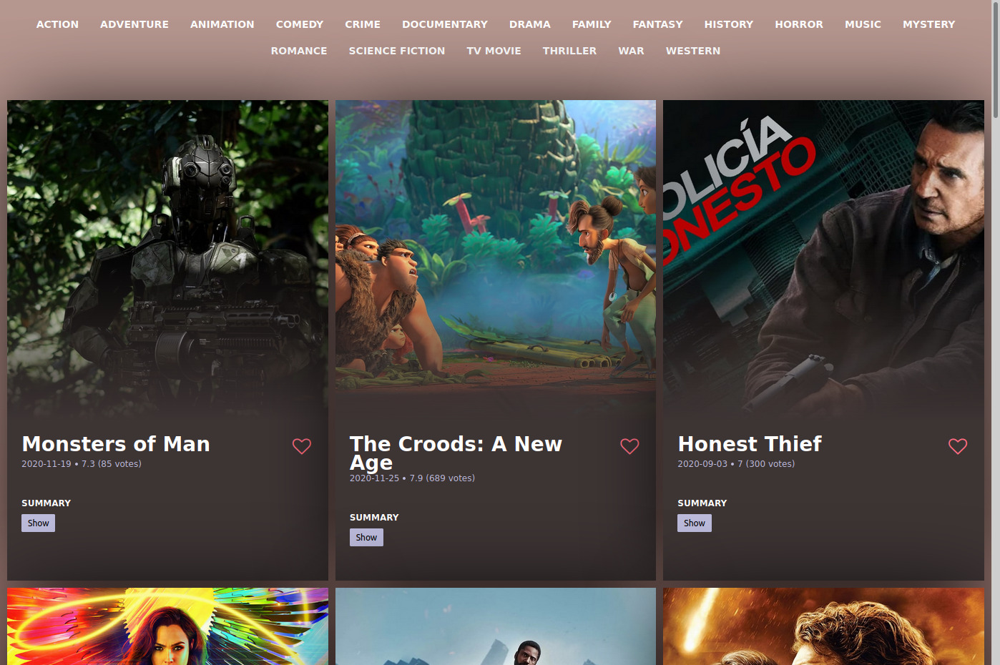

# Movie App

Simple movie app with react + redux. Built as homework for coding bootcamp.

## Built with

- [ReactJs](https://reactjs.org/)
- [Redux](https://redux.js.org/)
- [Movie DB API](https://www.themoviedb.org/)

## Requirements

- :heavy_check_mark: User can see movie genres
- :heavy_check_mark: User can switch between movie genres
- :heavy_check_mark: User can like movie
- :heavy_check_mark: User can remove like

## Installation

- Nodejs
- Npm

```bash

# clone repository
git@github.com:EvaldasBurlingis/react-redux-movie-app-nfq.git

# change directory
cd react-redux-movie-app-nfq

# install npm dependencies
npm install

# copy .env 
cp .example.env .env

# add your api key to .env file

# run application
npm run start

```

## Screenshot

<div>
    
</div>